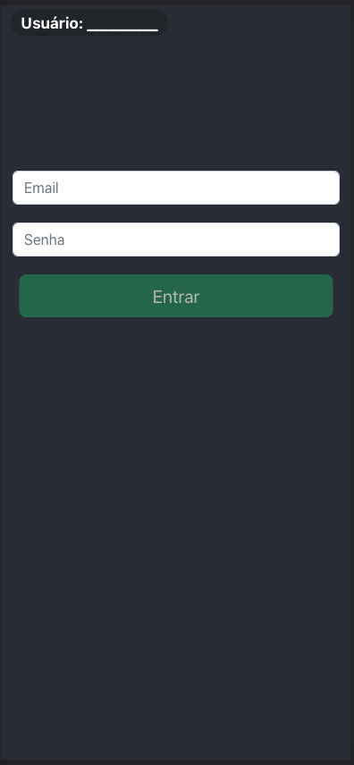
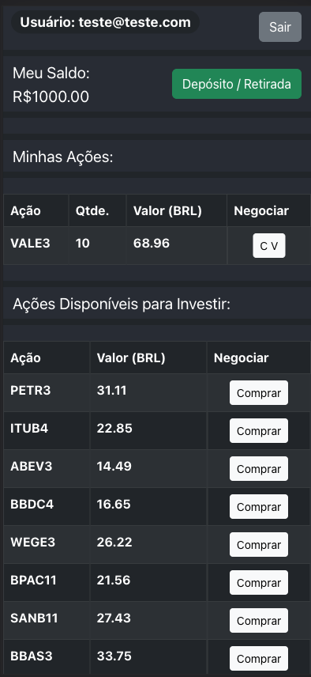
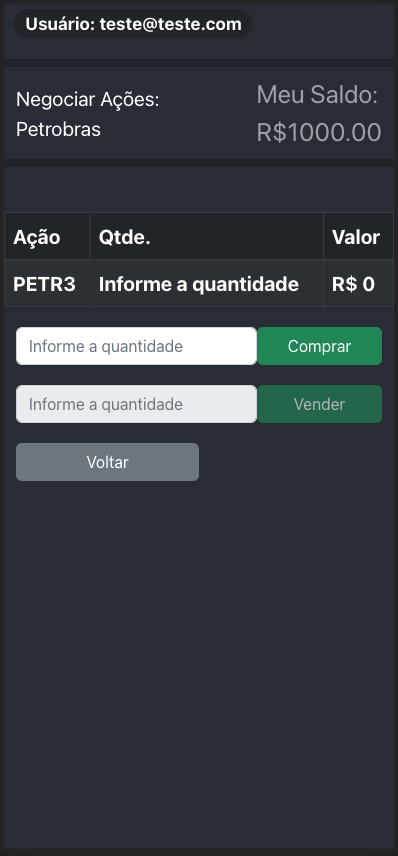
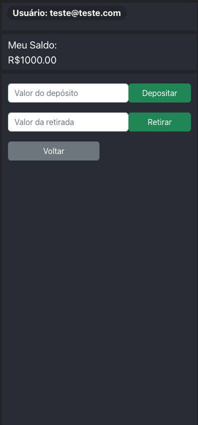
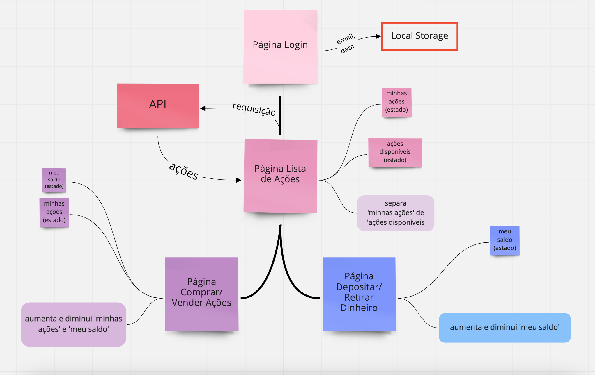

# Desafio Técnico XP - Matheus Januário - FrontEnd/Mobile
Para o Desafio Técnico do processo seletivo destinado à Turma XP da Trybe, optei por desenvolver a aplicação FrontEnd/Mobile. 


## Clonando o repositório e instalando dependências

Conforme as instruções, meu projeto está no [repositório remoto do github](https://github.com/matheus-januario/desafio-tecnico-xp-frontend). O comando a seguir pode ser usado para cloná-lo em seu computador. 

```bash
  git clone git@github.com:matheus-januario/desafio-tecnico-xp-frontend.git
```

Essa aplicação foi feita usando a biblioteca [React](https://pt-br.reactjs.org/) para javascript. Depois de clonar o repositório, acessando a página, é possível instalar as dependências do node com o seguinte comando:

```bash
  npm install
```

Para os testes, foi utilizada a biblioteca [React Testing Library](https://testing-library.com/docs/react-testing-library/intro/). Para rodar os testes, é necessário instalar a biblioteca com o seguinte comando:

```bash
  npm install --save-dev @testing-library/react
```

A estilização da aplicação foi feita com o framework [React Bootstrap](https://react-bootstrap.github.io/). Para visualizar a aplicação, é necessário instalar as dependências do framework com o seguinte comando:

```bash
  npm install react-bootstrap bootstrap
```
    
## API da aplicação

Para essa aplicação FrontEnd, optei por montar uma API com uma lista de ações.
Essa API tem um único endpoint. Para alimentar minha aplicação com esta lista de ações, faço uma requisição GET para esse endpoint. Você pode ver a lista de ações no link abaixo.

#### Link para o repositório github da API ]:

```bash
  https://github.com/matheus-januario/API-STOCKS
```
#### URL da API:

```bash
  https://api-stocks-mjc.herokuapp.com/
```
O deploy da API foi feito na plataforma [Heroku](https://www.heroku.com).
A resposta da API é um array de objetos. 
Cada objeto contém as informações de uma ação, como exemplifica a tabela abaixo:

| Chave | Valor     | Descrição                |
| :-------- | :------- | :-------------------- |
| `id` | `number` | id único de cada objeto |
| `name` | `string` | nome da empresa|
| `symbol` | `string` | símbolo da ação|
| `priceBRL` | `number` | valor de cada ação em real|
| `quantity` | `number` | quantidade de ações dessa empresa que o usuário possui|

## Testes

Como já mencionado, para os testes da aplicação escolhi a [React Testing Library](https://testing-library.com/docs/react-testing-library/intro/).
O comando usado para rodar os testes é o seguinte:

```bash
   npm test
```
Os testes estão separados por páginas, cada página tem um arquivo.
Infelizmente não pude implementar os testes para a páina Lista de Ações, é a única que não tem testes.
Para as outras, os testes unitários estão implementados, testando elementos e componentes das páginas.
Os arquivos de teste estão no diretório src/tests/.
## Aplicação

### Gerenciamento de estados

Considerando o tamanho da aplicação, eu optei por usar contextAPI com Hooks para o gerenciamento de estados globais.
A implementação é suficientemente simples, e a aplicação pode aumentar, adicionando outras páginas por exemplo, sem que seja necessária uma mudança no gerênciamento de estados.
ContextAPI e Hooks podem ser usados em aplicações maiores que essa sem perder a eficácia.

### Páginas

A aplicação foi desenvolvida com quatro páginas:

- Login
- Lista de Ações
- Negociar Ações
- Depósito e Retirada

#### Página Login

A página Login recebe os inputs de Email e Senha.
O email é vaidado somente se seguir a estrutura teste@teste.com, e a senha deve ter no mínimo 6 caracteres.
O botão de Login só é habilitado se as validações dos inputs passarem.
Ao clicar no botão Login, o usuário é direcionado à Página Lista de Ações, e são gravados o email logado, e a data e horário do login no Local Storage.
Depois de logar uma vez, e clicar no botão 'Sair' na página Lista de Ações, o usuário é redirecionado para a página de Login, e seu email, o pultimo logado, é apresentado num header.



#### Página Lista de Ações

Ao renderizar, a página Lista de Ações faz a requisição para a API com o hook useEffect(), chamando a função getStocks().
Além de fazer a requisição, e pegar a resposta da API, essa função filtra as 'minhas ações' das 'ações disponíveis', impedindo que ações que o usuário já possui apareçam duplicadas na página.

Nesta página, o usuário pode também escolher comprar ações de empresas que ainda não possui, nos botões 'Comprar', que o redirecionam para a página Negociar Ações; e com os botões 'C V', que também o redirecionam para a página Negociar Ações.

Quando o usuário clica, tanto nos botões 'Comprar' quanto nos botões 'C V', esses setam o estado 'negotiatedStock' com a ação correspondente ao botão que foi clicado.
Também, na página Lista de Ações, existe um botão 'Depósito / Retirada', que redireciona o usuário para a página Depósito e Retirada.



#### Página Negociar Ações

Na página Negociar Ações, o usuário pode adiquirir ações da empresa selecionada.
O usuário só pode vender ações se já tiver alguma ação dessa empresa em 'minhas ações'. Do contrário o input de venda e o botão 'Vender' estarão desabilitados.
Se o usuário tentar comprar mais ações que seu saldo permite, um alert aparecerá na tela e a operação será impedida.
Assim que o usuário fizer qualquer negociação com sucesso, compra ou venda, será redirecionado para a pága Lista de Ações novamente.



#### Página Depósito e Retirada

Na página Depósito e Retirada, o usuário pode retirar e depositar valores no seu saldo.
Se o usuário tentar retirar um valor maior que seu saldo permitir, um alert dispara e a operação é impedida.
Assim que o usuário fizer uma transação de sucesso, depósito ou retirada, será redirecionado para a pága Lista de Ações novamente.



### Diagrama

Segue abaixo um diagrama ilustrando os caminhos entre as páginas, os estados globais que cada uma pode modificar, e os fluxos de dados na aplicação.




Aagradeço a atenção! :rocket::rocket::rocket:

#### 🔗 Link:

[](https://www.linkedin.com/in/matheusjanuario/)
